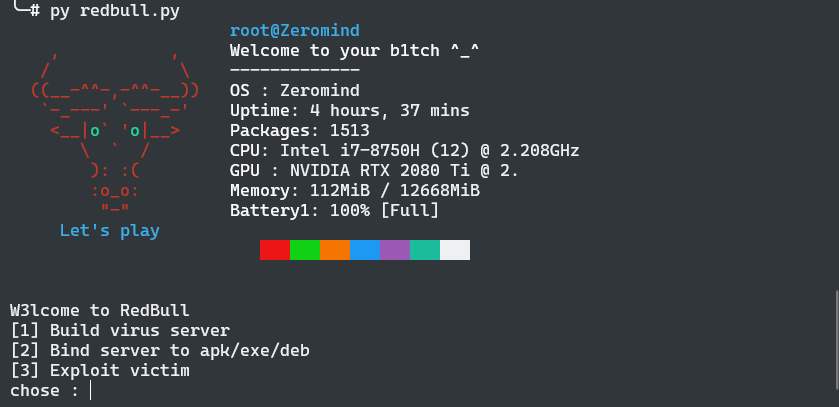

# RedBull


RedBull is a tool to make it easier to create viruses/servers in the Metasploit framework. This tool is still in the development stage, some of the features I added are also quite relevant to be used in pentest activities.

Because this tool uses Metasploit as a framework, the thing you have to do is install metasploit, if not, follow the method below.

```python
#open folder requirement using cd
cd requirement
#give access 755 to file msfinstall
chmod 755 msfinstall
#run file msfinstall
./msfinstall
```
#
For the initial CLI view, I used neofetch to create an ascii view as well as information about the system. Therefore, install Neofetch on your system, if not, you can follow the method below.
```python
#you can use apt-get
apt-get install neofetch
```
If the supporting packages are already installed, then we run the `redbull.py` file
```python
python3 redbull.py
```



```python
#some of the features available for now are
├── [1] Build virus server
│   ├── Android
│   ├── Linux
│   ├── Windows
├── [2] Bind server
│   ├── Android
│   ├── Linux
│   ├── Windows
├── [3] Exploit
│   ├── Metasploit